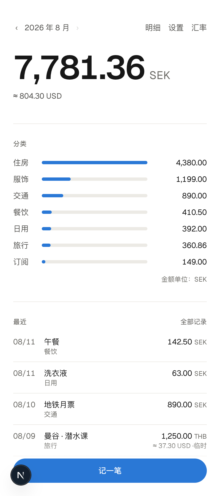
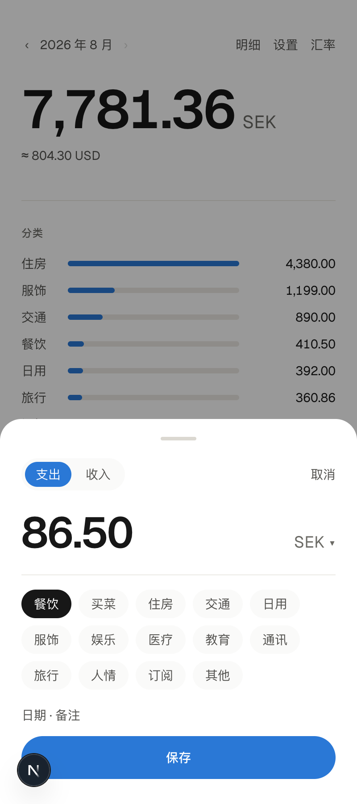
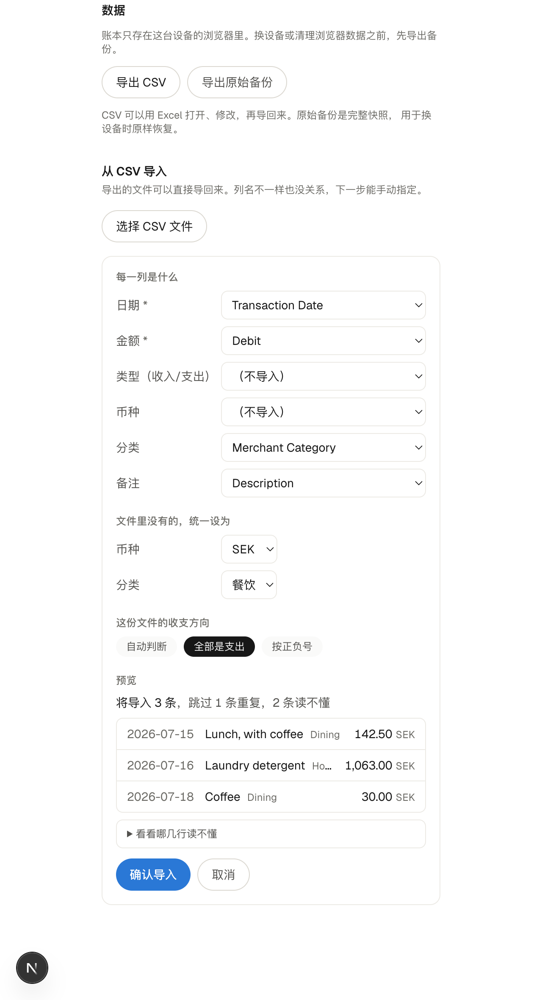
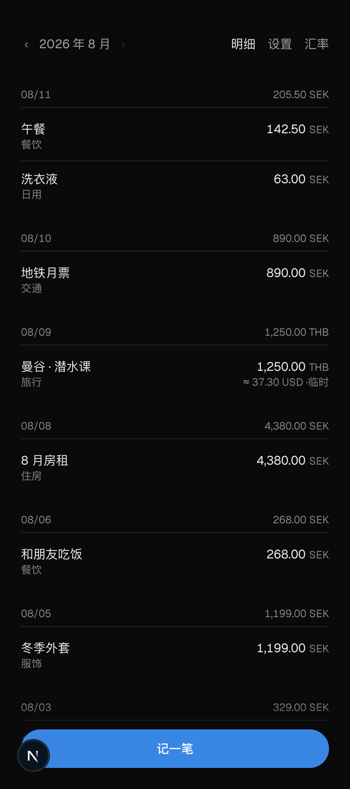

# Multi-Currency Finance

**English** · [中文](README.zh-CN.md)

A personal expense tracker for people whose money lives in more than one currency.
**Your ledger never leaves your browser — the backend only ever handles public exchange rates.**

[](https://github.com/maevezhang0129/multi-currency-finance/actions/workflows/ci.yml)
[](LICENSE)

**[→ Try it live](https://multi-currency-finance.vercel.app)**

<p align="center">
  
  
</p>

If you live in Sweden, travel to Thailand, and still hold assets in China, *"how
much did I spend this month"* stops being a question with one answer. This tool
exists to answer it.

---

## What it does

**Track**
- Three taps to log an expense: open → type amount → pick category → save
- Income and expenses have separate category lists
- Browse by month; entries grouped by day; tap any row to edit or delete
- Categories are fully editable — add, remove, reorder, rename (renaming updates existing entries)

**Multi-currency**
- Spend 1,250 THB, see `≈ 37.30 USD` next to it
- Conversion uses the rate for **the month the transaction happened**, then freezes.
  A purchase from last year never silently changes because today's rate moved
- The current month has no monthly average yet, so those entries are converted
  provisionally, labelled as such, and recomputed once the month closes

**Your data stays yours**
- Everything lives in browser `localStorage`. The server cannot read it, by design
- Export to CSV (opens cleanly in Excel) or a full JSON backup, any time
- CSV import handles column names that don't match — auto-detect, manual mapping, preview before writing

**Exchange rates**
- A monthly cron pulls ECB reference rates and stores the month's average
- Trend chart uses small multiples — one panel per currency ([why not one chart with three lines](#four-three-charts-not-one-chart-with-three-lines))

**Installable, and works offline**
- Add to home screen and it opens like a native app — no address bar
- A hand-written service worker (~130 lines, no Workbox) caches the shell, the
  build output, and the last rates response. Kill the server and the app still
  opens, still records, still converts
- It also asks the browser for persistent storage, so the ledger isn't evicted
  when the disk gets tight. Settings shows honestly whether that was granted

<p align="center">
  
  
</p>

<p align="center">
  <sub>Left: a statement with English column names — two columns auto-detected, two mapped by hand,
  and a preview that states plainly "3 will import, 1 duplicate, 2 unreadable."<br/>
  Right: entries grouped by day, with a per-day subtotal.</sub>
</p>

---

## Design decisions worth defending

The full list lives in the [Chinese README](README.zh-CN.md#设计取舍). These four
carry the most weight.

### One. The ledger never touches the database

Financial records live only in `localStorage` and in files the user exports.
The backend cannot read them.

**Why not store them?** The moment financial data hits a database, the project
inherits encryption at rest, key rotation, backup policy, cross-border compliance,
and breach notification. An open-source side project can't honour any of those —
and users don't get hurt any less because it was "just a portfolio piece."

**What it buys.** No user data → no accounts → no password hashing, no session
management, no OAuth callbacks, no broken access control. One architectural
decision removes the single largest source of security incidents in a full-stack app.

This isn't maintained by discipline alone. Two mechanical guardrails enforce it:

1. `src/db/index.ts` and `src/lib/env.ts` both start with `import "server-only"`.
   Any code path that pulls the database or secrets into a client component
   **fails at build time**, not at runtime after the connection string has already
   shipped in a browser bundle.
2. The `fx_rates` table has RLS enabled with **no policies**. Supabase exposes
   `public` schema tables through PostgREST to the anon key by default; with RLS on
   and no policy, that role reads nothing. The only way in or out is our own API.

### Two. Converted amounts freeze, and never recompute

Each transaction is converted using the rate for the month it happened, then stored.
Later rate updates don't touch it.

The alternative — recomputing history with today's rate — means the user opens the
app each morning and finds last year's numbers have changed. A past that already
happened shouldn't be rewritten by today's FX market.

This collides with reality: the cron only ingests **completed** months, so an expense
logged today has no monthly average yet. Rather than pick between showing nothing
(half the information missing) or reusing last month's rate as if it were this
month's (a lie), conversions carry a `frozen` flag. Provisional ones are labelled in
the UI and recomputed exactly once, when the real average lands.

### Three. Money is never a JavaScript number

Amounts and rates are strings end to end; arithmetic goes through a small BigInt
decimal module. Binary floating point cannot represent `0.1`, and the error
compounds — one cent at a time — until a monthly total is off in a way nobody can
explain.

Three tests exist purely as tripwires, each a case floating point gets wrong:
`0.1 × 3`, `1.005 × 100`, and `0.1` summed a hundred times. Any `Number()` slipped
into that path fails them immediately.

### Four. Three charts, not one chart with three lines

USD buys roughly 9.6 SEK, 33 THB, and 6.8 CNY. Plotted on one linear axis, THB
owns the vertical space and the other two flatten into near-horizontal lines — the
chart is still there, the information isn't. A dual axis is worse: how the two
scales align is arbitrary, so the picture invents a correlation the data doesn't have.

So: small multiples. One panel per currency, each with its own axis, aligned
vertically so shapes stay comparable while every number remains a real rate.
Indexing all three to 100 at a base period would also work, but then "how many
kronor is a dollar" — the number that actually matters when you're logging an
expense — disappears.

Chart colours were run through a contrast/CVD validator rather than picked by eye,
in both light and dark. Dark mode is a separately chosen set of steps, not an
inversion.

---

## How this was built

**This project was written end to end with Claude Code.** [`CLAUDE.md`](CLAUDE.md)
in the repo is the working brief I gave it: stack choices, architectural
constraints, domain rules, and a running list of things that turned out to be traps.

Keeping it in the repo is deliberate. I think the more interesting thing to show
right now isn't that I can type the code — it's whether I can direct a model to
ship something that holds up to engineering review. Concretely, my job in this
project was:

- **Set constraints and make them stick.** "Ledger data never reaches the database"
  isn't a slogan; it's enforced by `server-only` at build time and RLS at the
  database.
- **Correct course when it drifted.** This started as a "full-stack showcase" where
  features were deliberately minimal. After the exchange-rate pipeline shipped I
  changed the goal to "build a ledger I actually use daily," and `CLAUDE.md` records
  the revision and the reason.
- **Refuse vague implementations.** The "FX impact" line is still unbuilt, because
  we couldn't settle what two quantities it should subtract. A number that looks
  precise but can't be explained is worse than no number.
- **Demand evidence over assertion.** Every "measured" claim in these docs maps to
  something actually run — the data source's rate-limiting behaviour, which region
  the functions land in, how the CSV parser handles real-world mess.

The commit history is intact, including the wrong turns. One example: CSV import
originally inferred expense-vs-income row by row from the amount's sign, which
classified an entire statement of positive expenses as income. The test suite
caught it on the first run.

---

## Architecture

```
┌─ Browser ─────────────────────────────────────────────┐
│  ledger entries → localStorage  ·  exported files      │
│  conversion & aggregation run here, on-device          │
└───────────────────────▲───────────────────────────────┘
                        │  monthly rates, read-only
        ════════════════╪════════════════  trust boundary
                        │  ledger data never crosses downward
┌─ Backend ─────────────┴───────────────────────────────┐
│  Vercel Cron → Frankfurter (ECB) → monthly average     │
│              → Postgres (one table) → GET /api/fx      │
└────────────────────────────────────────────────────────┘
```

The backend handles exactly one kind of data: public exchange rates, identical for
everyone. It has no concept of a user.

**Pure functions carry the logic; IO stays thin.** Month arithmetic, decimal money,
conversion policy, aggregation, batching, CSV parsing and import planning are all
side-effect free and covered by tests. The pieces that talk to the network,
the database, or `localStorage` are deliberately small.

---

## Stack

| Layer | Choice | Why |
|---|---|---|
| Framework | Next.js 16 (App Router) | One repo, one deploy, shared types across the boundary |
| Language | TypeScript (strict) | Plus `noUncheckedIndexedAccess`; no `any` anywhere |
| Database | Supabase (Postgres) | Managed Postgres with a free tier; stores only public rate data |
| ORM | Drizzle | Schema is TypeScript; migrations are reviewable SQL, not a black box |
| Scheduling | Vercel Cron | Configured in the repo, no extra infrastructure |
| Charts | Recharts | |
| Hosting | Vercel | Functions pinned to `icn1` to sit beside the database |

**219 tests**, concentrated in the pure-function layer. CI runs typecheck, lint,
and tests on every push.

---

## Running locally

Requires Node 22 (see `.nvmrc`).

```bash
npm install
cp .env.example .env.local   # fill in your Supabase connection strings
npm run db:migrate
npm run dev
```

The ledger works without any backend — rates simply show as unavailable and
conversions are filled in later. See the [Chinese README](README.zh-CN.md#本地运行)
for the connection-string details and a network troubleshooting guide.

## API

One endpoint. It serves public rate data and needs no authentication.

```bash
curl "https://multi-currency-finance.vercel.app/api/fx?quote=SEK,CNY&from=2024-01&to=2024-03"
```

```jsonc
{
  "base": "USD",
  "from": "2024-01",
  "to": "2024-03",
  "series": [
    { "quote": "SEK", "points": [{ "month": "2024-01", "rate": "10.4012857143" }] }
  ]
}
```

`rate` is a **string**, not a number — the column is `numeric`, and converting at
the API boundary would lose precision that can't be recovered. An empty range
returns `200` with empty arrays, not `404`: asking about 1990 is a valid question
whose answer happens to be nothing, and the UI needs to tell "no data" apart from
"wrong URL." Full parameter reference in the
[Chinese README](README.zh-CN.md#get-apifx).

---

## Not doing

No accounts or login, no mobile app, no collaboration, no AI advice engine, no bank
or payment-provider integrations.

The first one is an architectural decision, not a backlog item — see
[design decision one](#one-the-ledger-never-touches-the-database).

## License

MIT — see [LICENSE](LICENSE).
